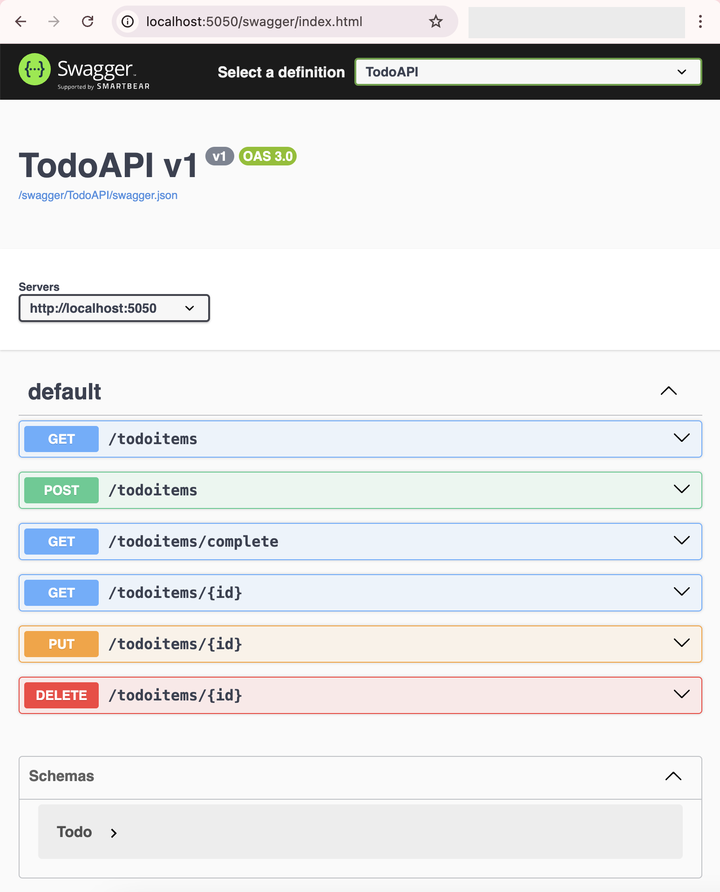
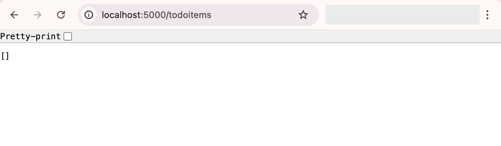

# Dotnet Demo API

This simple api demo application was created from [Tutorial: Create a minimal API with ASP.NET Core](https://learn.microsoft.com/en-us/aspnet/core/tutorials/min-web-api?view=aspnetcore-8.0&tabs=visual-studio-code). This demo application stores todo items in memory.

---
## Build and run for Development
```bash
dotnet run --project ./TodoApi/TodoApi.csproj
```

You can access the api on port **5050**. You can also access the swagger endpoint in development mode to see and test the available endpoints.

http://localhost:5050/swagger



---
## Build and run for Deployment
```bash
dotnet publish -o ./Release
dotnet ./Release/TodoApi.dll
```

You can access the exposed endpoints with your browser, but not swagger on port **5000**.

http://localhost:5000/todoitems

